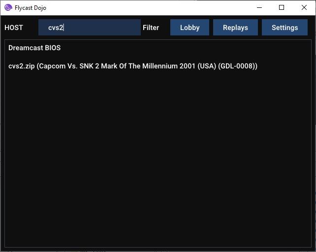

Flycast Dojo
===========
**Flycast Dojo** is a fork of [**Flycast**](https://github.com/flyinghead/flycast), a multi-platform Sega Dreamcast, Naomi and Atomiswave emulator derived from [**Reicast**](https://reicast.com/), with a focus on netplay features and replay. We intend to keep **Flycast Dojo** updated with the latest downstream changes made to the parent project.

General information about flycast configuration and supported features can be found on [**TheArcadeStriker's flycast wiki**](https://github.com/TheArcadeStriker/flycast-wiki/wiki)

# Starting a Netplay Session
You can find the Netplay settings under the "Netplay" section of the emulator's settings:


## Lobby Quick Start
If you are connected to your opponents on a shared LAN or are using software that emulates local connections like ZeroTier or Radmin VPN, you can make your life easier by enabling lobbies.

* In the Netplay options, check "Enable Lobby" to make yourself visible to anyone connected to your network.
* Set a unique Player Name to distinguish yourself from the crowd.

### As Host
* In the Lobby screen, click "Host Game" and select your game of choice.


> Empty lobby with "Host Game" button highlighted


> Host game selection menu with search filter

#### Set Delay
When a guest joins a session, delay will automatically be set on the host's side according to packet round trip time. Use the slider to adjust the game to your liking, and press "Start Game" to begin your session. To detect the delay again, possibly after adjustment, click on the "Detect Delay" button after entering your opponent's IP.

Depending on the connection between you and your opponent and the tendency for network spikes, you may have to bump delay up to make your game smoother. The best course of action is to start low, and go higher until both you and your opponent have a smooth framerate.


### As Guest
* Click on any entries with the status of "Hosting, Waiting" to launch a game. The game will load, and the session will start once the host has selected delay.


# Replays
To see a listing of your recorded replay sessions to play back, click on the "Replays" button on the Flycast main screen.

To record your netplay sessions, just check the box that says "Record All Sessions". This will create a new replay file for each netplay session you run and will be saved in the `replays/` subdirectory.

To play the replay file, just click on the corresponding entry, and the replay data will played back in its corresponding game.


## Manual Operation

### Set Server IP & Port
If you are hosting and do not wish to use the lobby system, you can enter your server details manually in the "Netplay" settings. Once you have specified your session details, make sure that your opponent enters your IP address and port specified.

If you are a guest, make sure that "Act As Server" is not checked and that you have entered the matching IP address and port of your opponent in the "Server" column.

#### Manual Delay Calculation
To calculate delay, we would use the following formula:

`Ceiling( Ping / 2 * FrameDuration (16 ms) ) = Delay #`

For instance, if my opponent’s average ping is 42 ms, I would divide it by 32 ms (2 * 16 ms) and round it up to 2.

```
= Ceiling( 42 ms / 2*16 ms )
= Ceiling( 42 ms / 32 ms )
= Ceiling( 1.3125 )
= 2
```

### Launch Game
On the Flycast main screen, you may now select your game of choice. You may also filter your list of games by typing in the text box on the top of the screen.

If you are hosting, you must start the game first, then have your opponent join afterward. If you are joining someone else's game, you must wait for them to start first. Be sure that you and your opponent have the same files before starting your session. These would include your ROM files, as well at your `eeprom.net`/`nvmem.net` files found in your `data/` subdirectory.


# Command Line
You may also call Flycast from the command line. All command line flags correspond with the options found in `emu.cfg`. Here are some example calls:

## Server
```flycast.exe -config maplenet:Enable -config maplenet:ActAsServer=yes -config maplenet:ServerPort=6000 ControllerTest-DJ.cdi```

## Client
```flycast.exe -config maplenet:Enable -config maplenet:ActAsServer=no -config maplenet:ServerIP=127.0.0.1 -config maplenet:ServerPort=6000 ControllerTest-DJ.cdi```

## TCP Match Transmission (Spectating)
_append to server arguments_
```-config maplenet:Transmitting=yes -config maplenet:Receiving=no -config maplenet:SpectatorIP=<IP> -config maplenet:SpectatorPort=7000```

## TCP Match Receiving (Spectating)
```-config maplenet:Transmitting=no -config maplenet:Receiving=yes -config maplenet:SpectatorPort=7000```

## Test Game Screen
```-config maplenet:TestGame=yes```

# Video Demos
## Flycast Netplay Testing - Capcom vs SNK 2 (NAOMI) VS
[](http://www.youtube.com/watch?v=zZoonpVJRjI "Flycast Netplay Testing - Capcom vs SNK 2 (NAOMI) VS")

## Flycast Netplay Testing - Akatsuki Blitzkampf Ausf Achse (NAOMI) VS
[](http://www.youtube.com/watch?v=s0MXenZPLiU "Flycast Netplay Testing - Akatsuki Blitzkampf Ausf Achse (NAOMI) VS")

# Roadmap
- [x] UDP Delay Netplay
- [x] UDP Spectating
- [x] Session Replays
- [x] LAN Lobbies
- [x] TCP Spectating
- [ ] Linux Support (Partially Implemented)
- [ ] Offline Game Recording
- [ ] Offline Game Delay (Practice)
- [ ] Lua Scripting
