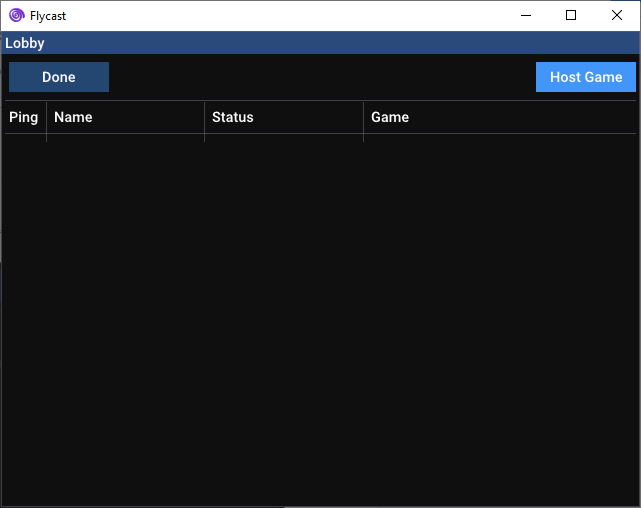

flycast-dojo
===========
**flycast-dojo** is a fork of [**flycast**](https://github.com/flyinghead/flycast), a multi-platform Sega Dreamcast, Naomi and Atomiswave emulator derived from [**reicast**](https://reicast.com/), with a focus on netplay features and replay. We intend to keep **flycast-dojo** updated with the latest downstream changes made to the parent project.

General information about flycast configuration and supported features can be found on [**TheArcadeStriker's flycast wiki**](https://github.com/TheArcadeStriker/flycast-wiki/wiki)

# Starting a Netplay Session
You can find the Netplay settings under the "Netplay" section of the emulator's settings:


## Lobby Quick Start
If you are connected to your opponents on a shared LAN or are using software that emulates local connections like ZeroTier or Radmin VPN, you can make your life easier by enabling lobbies.

* In the Netplay options, check "Enable Lobby" to make yourself visible to anyone connected to your network.
* Set a unique Player Name to distinguish yourself from the crowd.

### As Host
* In the Lobby screen, click "Host Game" and select your game of choice.


> Empty lobby with "Host Game" button highlighted


> Host game selection menu with search filter

### As Guest
* Click on any entries with the status of "Hosting, Waiting" to launch a game with auto detected delay.
* To set custom delay, right click on the entry and adjust accordingly. Click "Launch Game" to begin.


## Manual Operation

### Set Server IP & Port
If you are hosting and do not wish to use the lobby system, you can enter your server details manually in the "Netplay" settings. Once you have specified your session details, make sure that your opponent enters your IP address and port specified.

If you are a guest, make sure that "Act As Server" is not checked and that you have entered the matching IP address and port of your opponent in the "Server" column.

### Set Delay
To automatically set delay, click on the "Detect Delay" button after entering your opponent's IP. There's also a slider for manually setting delay if you run into any issues.

To calculate delay, we would use the following formula:

`Ceiling( Ping / 2 * FrameDuration (16 ms) ) = Delay #`

For instance, if my opponent’s average ping is 42 ms, I would divide it by 32 ms (2 * 16 ms) and round it up to 2.

```
= Ceiling( 42 ms / 2*16 ms )
= Ceiling( 42 ms / 32 ms )
= Ceiling( 1.3125 )
= 2
```

Make sure both you and your opponent have the same delay and game ROM to begin your game.

### Launch Game
On the Flycast main screen, you may now select your game of choice. You may also filter your list of games by typing in the text box on the top of the screen.

If you are hosting, you must start the game first, then have your opponent join afterward. If you are joining someone else's game, you must wait for them to start first. Be sure that you and your opponent have the same files before starting your session. These would include your ROM files, as well at your `eeprom.net`/`nvmem.net` files found in your `data/` subdirectory.

# Replays
To record your netplay sessions, just check the box that says "Record All Sessions". This will create a new replay file for each netplay session you run and will be saved in the `replays/` subdirectory.

To play the replay file, be sure to uncheck "Record All Sessions" and enable "Playback Local Replay File". The file representing your last session is automatically populated in the "Replay Filename" column by default.


# Command Line
You may also call Flycast from the command line. All command line flags correspond with the options found in `emu.cfg`. Here are some example calls:

## Server
```flycast.exe -config maplenet:Enable -config maplenet:ActAsServer=yes -config maplenet:ServerPort=7777 -config maplenet:Delay=1 C:\emu\flycast\games\dc\ControllerTest-DJ.cdi```

## Client
```flycast.exe -config maplenet:Enable -config maplenet:ActAsServer=no -config maplenet:ServerIP=127.0.0.1 -config maplenet:ServerPort=7777 -config maplenet:Delay=1 C:\emu\flycast\games\dc\ControllerTest-DJ.cdi```

# Video Demos
## Flycast Netplay Testing - Capcom vs SNK 2 (NAOMI) VS
[](http://www.youtube.com/watch?v=zZoonpVJRjI "Flycast Netplay Testing - Capcom vs SNK 2 (NAOMI) VS")

## Flycast Netplay Testing - Akatsuki Blitzkampf Ausf Achse (NAOMI) VS
[](http://www.youtube.com/watch?v=s0MXenZPLiU "Flycast Netplay Testing - Akatsuki Blitzkampf Ausf Achse (NAOMI) VS")

# Roadmap
- [x] UDP Delay Netplay
- [x] Network Match Streaming
- [x] Session Replays
- [x] LAN Lobbies
- [ ] Linux Support (Partially Implemented)
- [ ] Offline Game Recording
- [ ] Offline Game Delay (Practice)
- [ ] Lua Scripting
