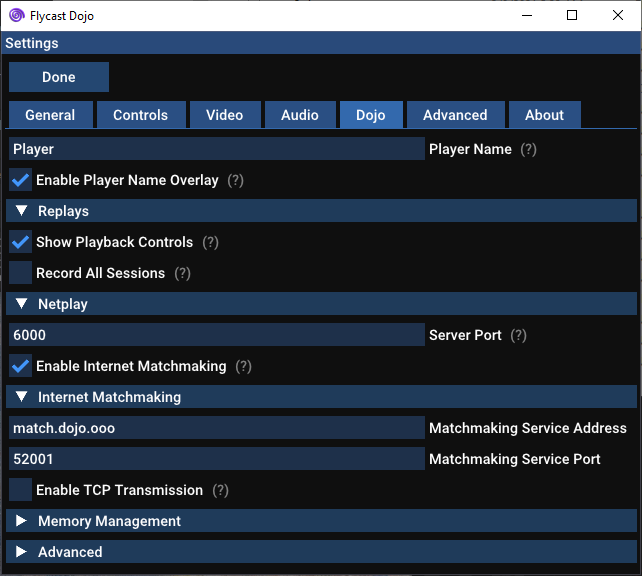
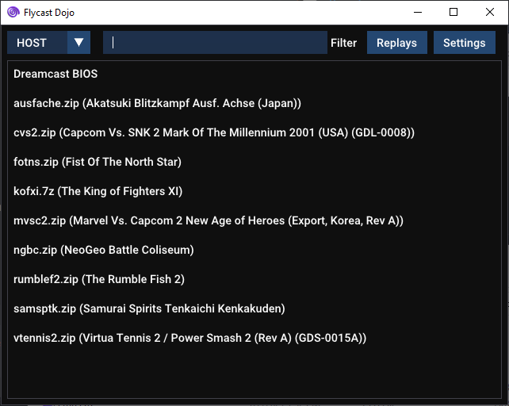
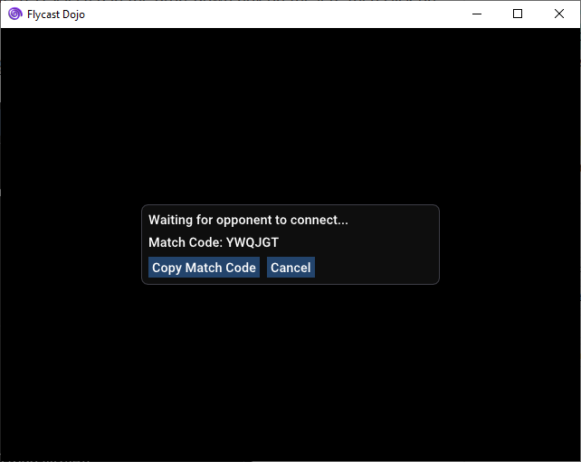
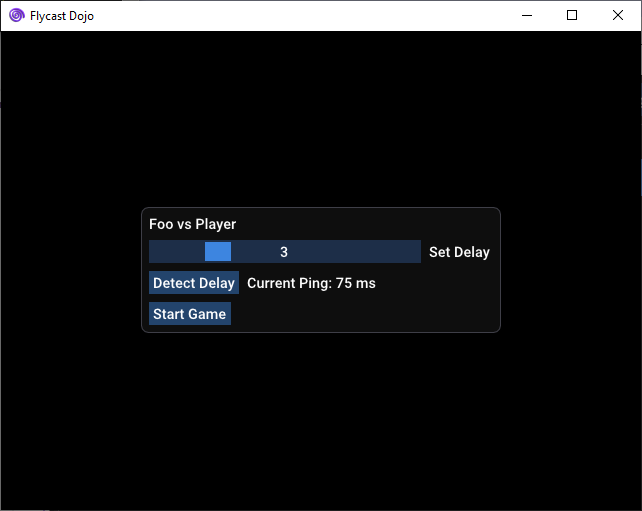
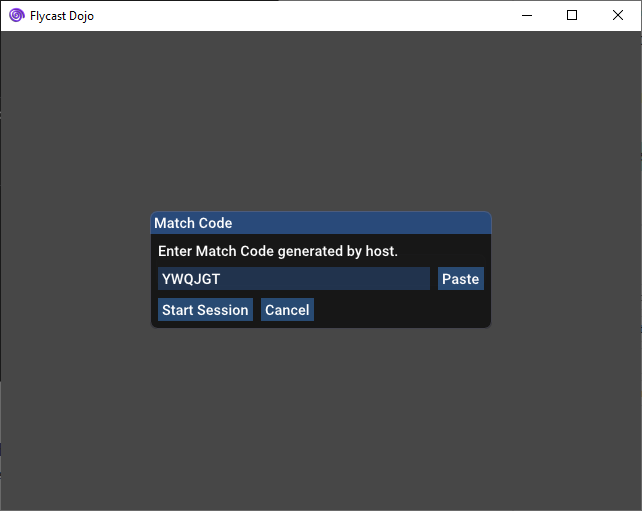
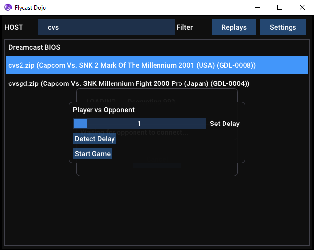
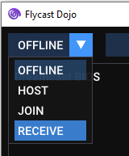
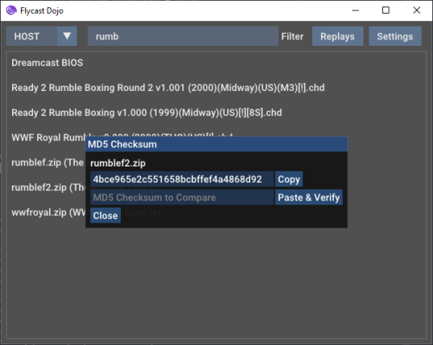
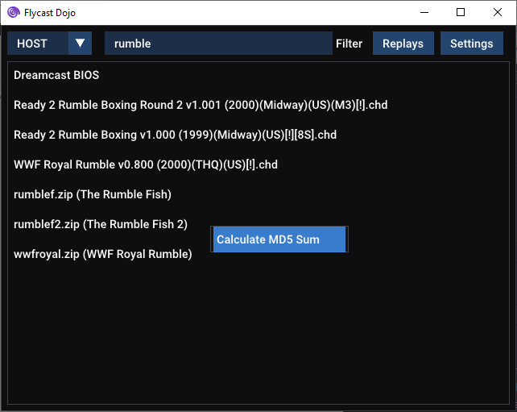
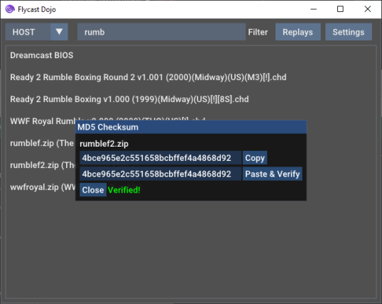

# Flycast Dojo

**Flycast Dojo** is a fork of [**Flycast**](https://github.com/flyinghead/flycast), a multi-platform Sega Dreamcast, Naomi and Atomiswave emulator derived from [**Reicast**](https://reicast.com/), with a focus on netplay features and replay. We intend to keep **Flycast Dojo** updated with the latest downstream changes made to the parent project.

**Flycast Dojo** can be retrieved from GitHub, or as a part of the [Fightcade](https://www.fightcade.com/) matchmaking service. However you obtain it, you will always have the option to use it standalone for P2P games either over a direct IP connection, an internet matchmaking server, or a virtual LAN like ZeroTier or Radmin.

General information about Flycast configuration and supported features can be found on [**TheArcadeStriker's flycast wiki**](https://github.com/TheArcadeStriker/flycast-wiki/wiki)

# Contents
- [Video Guides](#video-guides)
  * [Fightcade Quick Start](#fightcade-quick-start)
  * [LAN Lobby Quick Start](#lan-lobby-quick-start)
- [Getting Started](#getting-started)
- [Setting Controls](#setting-controls)
- [Starting a Netplay Session](#starting-a-netplay-session)
  * [Netplay Settings](#netplay-settings)
  * [Match Code Quick Start](#match-code-quick-start)
    + [As Host](#as-host)
      - [Set Delay](#set-delay)
    + [As Guest](#as-guest)
    + [Troubleshooting](#match-code-troubleshooting)
  * [Lobby Quick Start](#lobby-quick-start)
    + [As Guest](#as-guest-1)
    + [As Host](#as-host-1)
      - [Set Delay](#set-delay-1)
    + [As Spectator](#as-spectator)
  * [Manual Operation](#manual-operation)
    + [Set Server IP & Port](#set-server-ip--port)
    + [Delay Calculation](#manual-delay-calculation)
    + [Launch Game](#launch-game)
    + [Manual Spectating](#manual-spectating)
      - [Transmitting](#transmitting)
      - [Receiving](#receiving)
- [Replays](#replays)
    + [Public Replay Servers & Transmitting Game Sessions](#public-replay-servers--transmitting-game-sessions)
- [Savestates](#savestates)
    + [Auto Generated Savestates](#auto-generated-savestates)
    + [Custom Savestates](#custom-savestates)
- [MD5 Checksum Calculation & Validation](#md5-checksum-calculation--validation)
- [Command Line](#command-line)
  * [Netplay](#netplay)
  * [Spectating](#spectating)
  * [Test Game Screen](#test-game-screen)
- [Game-specific Guides](#game-specific-guides)
- [Video Demos](#video-demos)
- [Roadmap](#roadmap)

# Video Guides

## Fightcade Quick Start
[](https://www.youtube.com/watch?v=47oJOUoGYmI)

## LAN Lobby Quick Start
[](https://www.youtube.com/watch?v=VcalBJpbjxA)

# Getting Started
To get started with Flycast Dojo, make sure that you have the appropriate ROMs and BIOS files available in your ROM and data folders. At the time of writing, the preferred MAME romset for NAOMI & Atomiswave games is the **MAME 0.226** romset.

If you are running Fightcade, you can find the ROMs folder at `Fightcade\emulator\flycast\ROMS` while non-Fightcade users can use the `ROMS` folder in the Flycast folder.

For the sake of performance, it is advised that you keep your games and the emulator on the same drive.

For the BIOS, be sure to add `awbios.zip` for Atomiswave games or `naomi.zip` for NAOMI games into your `data` directory in the folder you have Flycast installed. In your settings, the folder Flycast is installed in is your **"Home Directory"**.

For more information on verifying your BIOS files, you can head to the [Flycast wiki page](https://github.com/TheArcadeStriker/flycast-wiki/wiki/Verifying-your-BIOS-and-Arcade-ROMs) on the topic.


# Setting Controls
To set up your controls in Flycast, launch the emulator and head to **Settings -> Controls**. Set your controller of choice to **Port A**. From there, press **Map** to open the **Controller Mapping** menu.

Select the **Arcade button names** checkbox to show the arcade button mapping. Inputs recognized as buttons can be assigned on the left hand side of the screen while inputs recognized as Axes are mapped on the right hand side.

The following is a sample mapping for XInput (XBOX 360) Controllers created by **pokeshark** on the [Official Fightcade Discord](https://discord.com/invite/EyERRSg). Note that the triggers are on the right hand side of the screen, corresponding with analog axes.


# Starting a Netplay Session

## Netplay Settings
You can find the Netplay settings under the **Dojo** section of the emulator's settings:



Match Codes are enabled by default, pointing to the default matchmaking relay. To use the LAN Lobby or Manual Operation (i.e., Command Line or External Lobbies) just disable the checkbox from **Enable Internet Matchmaking**, or pass `dojo:EnableMatchCode=no` to the command line options.


## Match Code Quick Start
Using Match Codes, Flycast Dojo can start a P2P game session behind firewalls, so that you can play against others without the need of Radmin or Fightcade. No need to sign up for any accounts or download additional software than Flycast Dojo itself. You should be able to play any games supported by Flycast, so long as you and your opponent have the same ROM.

The methods used by this feature should work with most consumer routers, but you may run into trouble over some cloud gaming services or corporate networks. (It is confirmed to work over Paperspace though, where I did much of my testing).

### As Host
You can set yourself as a host by making sure __HOST__ is selected in the drop-down box on the left, then click on the game to begin.



This will contact the default matchmaking relay and give you a code to send to your opponent. To make code transfer easier, press the __Copy Match Code__ button to add the code to your clipboard to paste to your opponent.



#### Set Delay
When a guest joins a session, the host can set the delay according to packet round trip time by pressing **"Detect Delay"**. Use the slider to adjust the game to your liking, and press "Start Game" to begin your session.

Depending on the connection between you and your opponent and the tendency for network spikes, you may have to bump delay up to make your game smoother. The best course of action is to start low, and go higher until both you and your opponent have a smooth framerate.



### As Guest
To join a game, click on the dropdown on the left and select __JOIN__ then select the game of your choice. It will prompt you for the match code. If you have copied the Match Code from your opponent, you can press the __Paste__ button, otherwise, you can enter in the match code manually.

Once you are done, you can press __Start Session__.



### Match Code Troubleshooting

If you notice disconnects at some regular interval (e.g. every 6 minutes, 10, minutes, 15 minutes), it may be possible that your router is closing the UDP route that was established by the matchmaking service by having a low UDP Timeout. This is similar to what can happen with VoIP calls on restrictive routers.

To fix this, find your router's **UDP Timeout** settings and set it to **90 seconds** or higher.  

If you are unable to find this setting, you can forward your router's port and [connect manually](#manual-operation), or use the [LAN Lobby](#lobby-quick-start) over a Virtual LAN service like ZeroTier or Radmin VPN.

For more information, check out [10 VoIP Problems: How to Fix Them Forever](https://www.nextiva.com/blog/voip-problems.html#s2).

## Lobby Quick Start
If you are connected to your opponents on a shared LAN or are using software that emulates local connections like ZeroTier or Radmin VPN, you can make your life easier by enabling lobbies.

* In the Netplay options, check "Enable Lobby" to make yourself visible to anyone connected to your network.
* Set a unique Player Name to distinguish yourself from the crowd.

### As Guest
* On the Lobby screen, click on any entries with the status of "Hosting, Waiting" to launch a game. The game will load, and the session will start once the host has selected delay.


### As Host
* In the Lobby screen, click "Host Game" and select your game of choice.


> Empty lobby with "Host Game" button highlighted


> Host game selection menu with search filter

#### Set Delay
When a guest joins a session, the host can set the delay according to packet round trip time by pressing **"Detect Delay"**. Use the slider to adjust the game to your liking, and press "Start Game" to begin your session.

Depending on the connection between you and your opponent and the tendency for network spikes, you may have to bump delay up to make your game smoother. The best course of action is to start low, and go higher until both you and your opponent have a smooth framerate.



### As Spectator
To spectate a match in your lobby, you will need to make a spectate request before a second player joins a match. Before spectating, make sure that you also have the same ROM as the players do.

Just right-click on any lobby game with the status of "Hosting, Waiting" and click on Spectate. From here, the game will start and pause until the match starts.

As of right now, spectating is limited to one person at a time. This should be handy for running tournaments online.


# Manual Operation

## Set Server IP & Port
If you are hosting and do not wish to use the lobby system, you can enter your server details manually in the "Netplay" settings. Once you have specified your session details, make sure that your opponent enters your IP address and port specified.

If you are a guest, make sure that "Act As Server" is not checked and that you have entered the matching IP address and port of your opponent in the "Server" column.

## Manual Delay Calculation
To calculate delay, we would use the following formula:

`Ceiling( Ping / 2 * FrameDuration (16 ms) ) = Delay #`

For instance, if my opponent’s average ping is 42 ms, I would divide it by 32 ms (2 * 16 ms) and round it up to 2.

```
= Ceiling( 42 ms / 2*16 ms )
= Ceiling( 42 ms / 32 ms )
= Ceiling( 1.3125 )
= 2
```

## Launch Game
On the Flycast main screen, you may now select your game of choice. You may also filter your list of games by typing in the text box on the top of the screen.

If you are hosting, you must start the game first, then have your opponent join afterward. If you are joining someone else's game, you must wait for them to start first. Be sure that you and your opponent have the same files before starting your session. These would include your ROM files, as well at your `eeprom.net`/`nvmem.net` files found in your `data/` subdirectory.

## Manual Spectating

### Transmitting
To transmit your current game session or replays, go into the **Dojo** settings tab and press the checkbox by **Enable TCP Transmission**. You can edit your target spectator IP Address and Port.


If you wish to enable transmitting when launching via the Command Line, just add ```-config dojo:Transmitting=yes -config dojo:SpectatorIP=<IP> -config dojo:SpectatorPort=7000``` to your command.

### Receiving
To manually launch a spectating session as a receiver, just select the **RECEIVE** option in the top-left menu and select the game of your choice. Flycast Dojo will stay idle until it begins receiving a transmission to the spectating port. By default, this is on port **7000**.



To launch as a receiver via the Command Line and set your listening port, add ```-config dojo:Receiving=yes -config dojo:SpectatorPort=7000``` to your command.

# Replays

To see a listing of your recorded replay sessions to play back, click on the "Replays" button on the Flycast main screen.

To record your netplay sessions, just check the box that says "Record All Sessions". This will create a new replay file for each netplay session you run and will be saved in the `replays/` subdirectory.

To play the replay file, just click on the corresponding entry, and the replay data will played back in its corresponding game.


## Public Replay Servers & Transmitting Game Sessions

If you wish to share your game sessions, there is an option to transmit to any replay server or to any listening spectator with the **RECEIVE** option set.

There is currently an experimental public replay server available at **match.dojo.ooo**. The server accepts transmissions at port **7000**, with an interface to search and download replays at [http://match.dojo.ooo:8000/replays](http://match.dojo.ooo:8000/replays).

**Transmitting to Replay Server**


**Replay Server Search Interface**


Once some code cleanup and quality checks are done, the replay server will be made available in its own repository for anyone to be able to host themselves.

# Savestates
During a netplay match, you can "jump" to a starting savestate by pressing the **Backspace** button by default. This may be edited in the Control mapping section of the Settings.

## Auto Generated Savestates
To help mitigate desyncs and to easily restart game sessions, if one isn't detected, Flycast Dojo automatically generates a savestate shortly after the boot sequence to provide a starting point to rewind a session. If it is detected that you and your opponent have a savestate, the match will start right after the boot sequence to save time.

If you ever encounter any isues, you can delete the savestate located in `data/[ROM Name].state.net` to have the emulator start from the boot sequence and generate a savestate in your next match.

## Custom Savestates
To use custom savestates, you must first disable **Ignore Netplay Savestates** in the **Memory Management** section of your Dojo settings.


Fro here, you must rename your desired game savestate to be `[ROM Name].state.net` and replace the existing file in your `data/` folder. Be sure you and your opponent have the same files when you start a session, or else you will be looking at different game states entirely.

# MD5 Checksum Calculation & Validation
In order for netplay to work, both you and your opponent must have the same ROM on both computers. Players using different ROM variants can lead to desyncing. Oftentimes, verifying the validity of ROMs can be a pain, leading folks to reacquire them unnecessarily in a game of guess and check. To solve this issue,  MD5 checksum calculation and validation has been made available.



To access this, just right click on any ROM name, and click "Calculate MD5 Checksum". A dialog will pop up showing the MD5 checksum of the selected ROM, and a button to easily copy it to the clipboard to share with your opponent.



To verify that you have the same ROM as your opponent, just copy the MD5 checksum given to you, and click the "Paste & Verify" button. If your ROMs match, you'll see a green "Verified!" by the Close button. If the hashes do not match, it will say "Mismatch." in red.



If a `flycast_roms.json` file is found, it should contain a listing of MD5 checksums for approved ROMs between users. This format is intended for communities to share common ROM metadata between users to ensure that everyone has the same files.

If your ROM is found in this file, the MD5 Checksum window will say *"Validation File Match"*. So long as you see this, you should be good to go!


# Command Line
You may also call Flycast from the command line. All command line flags correspond with the options found in `emu.cfg`. Here are some example calls:

## Netplay
 * Server (Without Match Codes)

```flycast.exe -config dojo:Enable=yes -config dojo:EnableMatchCode=no -config dojo:ActAsServer=yes -config dojo:ServerPort=6000 -config dojo:PlayerName=Player1 ControllerTest-DJ.cdi```

*  Client (Without Match Codes)

```flycast.exe -config dojo:Enable=yes -config dojo:EnableMatchCode=no -config dojo:ActAsServer=no -config dojo:ServerIP=127.0.0.1 -config dojo:ServerPort=6000 -config dojo:PlayerName=Player2 ControllerTest-DJ.cdi```

## Spectating
 * TCP Match Transmission (Spectating)

_append to server arguments_

```-config dojo:Transmitting=yes -config dojo:SpectatorIP=<IP> -config dojo:SpectatorPort=7000```

 * TCP Match Receiving

```-config dojo:Receiving=yes -config dojo:SpectatorPort=7000```

## Test Game Screen

```-config dojo:TestGame=yes```

# Game-specific Guides
 * [The Rumble Fish 2 Wiki - Netplay](https://wiki.gbl.gg/w/The_Rumble_Fish_2/Netplay)
 * [Akatsuki Blitzkampf Wiki - Netplay](https://wiki.gbl.gg/w/Akatsuki_Blitzkampf/Netplay)

# Video Demos
## Flycast Netplay Testing - Capcom vs SNK 2 (NAOMI) VS
[](http://www.youtube.com/watch?v=zZoonpVJRjI "Flycast Netplay Testing - Capcom vs SNK 2 (NAOMI) VS")

## Flycast Netplay Testing - Akatsuki Blitzkampf Ausf Achse (NAOMI) VS
[](http://www.youtube.com/watch?v=s0MXenZPLiU "Flycast Netplay Testing - Akatsuki Blitzkampf Ausf Achse (NAOMI) VS")

## Flycast Dojo - Spectating / TCP Transmission - Test 1
[](https://www.youtube.com/watch?v=AmRf7MwOrQA)

## Flycast Dojo - The Rumble Fish 2 (Atomiswave) - LAN Lobby Spectating Test 1
[](https://www.youtube.com/watch?v=U9Nexso4lpo)

# Roadmap
- [x] UDP Delay Netplay
- [x] UDP Spectating
- [x] Session Replays
- [x] LAN Lobbies
- [x] TCP Spectating
- [x] Offline Game Recording
- [x] Offline Game Delay (Practice)
- [ ] Native Linux Support
- [ ] Native Mac OS Support
- [ ] Lua Scripting
